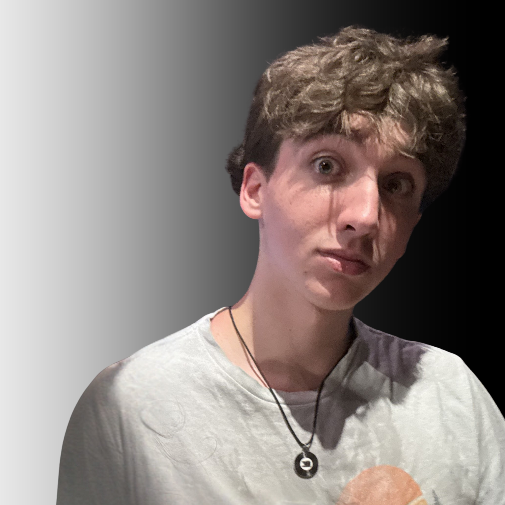

# Charlie Barra Portfolio

<p align="center">
  
</p>

<p align="center">
  <strong>A collaborative portfolio presenting my game design, programming, competitive Pokémon, and interactive world-design work.</strong>
</p>

<p align="center">
  <a href="https://www.charliebarra.com/">View the Live Site</a>
  ·
  <a href="https://github.com/charliebarra/meteor-mayhem">Meteor Mayhem Repository</a>
  ·
  <a href="https://www.youtube.com/@charlie-barra">Project Videos</a>
</p>

---

## Why I Built This

I wanted one place where someone could see both **what I built** and **how I got there**.

The site started as a way to organize projects for college applications, but it became a record of the questions behind them. Most of the work follows the same pattern: I notice something, wonder why it works that way, build something to test it, and usually end up with another question.

I supplied the original projects, source materials, factual details, reflections, and final review. The website's structure, editorial refinement, code implementation, accessibility work, and quality assurance were developed with assistance from OpenAI's ChatGPT.

## What Is in the Portfolio

### Story

A timeline showing how games, competitive Pokémon, Roblox, Minecraft, programming, and cybersecurity gradually changed the questions I was asking.

### Work

A short project index that leads to the main case studies:

- **Meteor Mayhem** — original multiplayer strategy card game
- **Swap Monsters** — published Godot platformer built around three character abilities
- **Programming Projects** — four chronological Python and Java projects
- **Interactive World Design** — Roblox Studio and Lua experiments

### Competitive Play

My experience competing in the Pokémon Trading Card Game, including international events and the World Championships.

### Field Notes

Short observations about games, balance, players, interfaces, prototypes, and questions I am still thinking about.

### Resume and Contact

A downloadable résumé and links to GitHub, YouTube, and the rest of the portfolio.

## Featured Case Study

### Meteor Mayhem

Meteor Mayhem is the most complete case study on the site.

It includes:

- the original design question,
- early planning and process images,
- physical prototypes,
- playtesting photos,
- an expandable playtesting journal,
- the Meteor Mayhem Rulebook (Prototype Edition),
- probability and balancing notes,
- card sheets,
- a video walkthrough,
- and ideas I would explore next.

[Read the Meteor Mayhem case study](https://www.charliebarra.com/meteor-mayhem.html)

[View the Meteor Mayhem Rulebook (Prototype Edition)](documents/Meteor-Mayhem-Rulebook.pdf)

### Swap Monsters

Swap Monsters is a published Godot platformer created independently over seven working days during a two-week, 30-hour Urban Arts course. Starting from the supplied Endless Access Moddable Platformer framework, I developed a new cave game with three character abilities, a limited switching meter, breakable-object interactions, and an original route and progression.

[Read the Swap Monsters case study](https://www.charliebarra.com/swap-monsters.html)

[Play Swap Monsters on itch.io](https://spaceninja910.itch.io/swap-monsters)

[Watch the Swap Monsters walkthrough](https://youtu.be/zS3NLN07p0Y)

[View the Swap Monsters repository](https://github.com/charliebarra/swap-monsters)

## Technology

The site intentionally uses a simple stack:

- **HTML5**
- **CSS3**
- **Vanilla JavaScript**
- **GitHub Pages**
- **YouTube embeds**
- **No framework**
- **No build step**

I kept the setup simple so the project would be easy to understand, update, and deploy.

## Repository Structure

```text
portfolio/
├── index.html                  # Home
├── story.html                  # Personal timeline
├── projects.html               # Work index
├── meteor-mayhem.html          # Flagship case study
├── swap-monsters.html          # Godot game case study
├── programming.html            # Python and Java projects
├── world-design.html           # Roblox design studies
├── pokemon.html                # Competitive Pokémon
├── notebook.html               # Field Notes
├── resume.html                 # Résumé overview
├── contact.html                # Contact links
├── styles.css                  # Shared visual system
├── script.js                   # Lightbox and interactions
├── assets/
│   └── images/                 # Optimized site images
├── documents/
│   └── Charlie-Barra-Resume.pdf
├── favicon.ico
├── site.webmanifest
└── README.md
```

Some redirect pages remain in the repository so older links continue to work.

## Design Decisions

### One shared visual system

All main pages use the same navigation, typography, spacing, cards, buttons, and footer styles.

### Mobile first enough to matter

Visitors may open the portfolio on a phone or tablet, so the site includes:

- responsive grids,
- stacked project layouts,
- larger touch targets,
- mobile-friendly navigation,
- reduced-motion support,
- and images that resize without overflowing.

### Process over polish

The site does not only show finished work. It also includes sketches, early versions, playtesting evidence, bugs, changes, and questions that are still open.

That part matters to me because the finished project is usually not the most interesting part of the story.

### Accessibility

The site includes:

- semantic HTML,
- descriptive image alt text,
- visible keyboard focus,
- a skip-to-content link,
- labeled gallery controls,
- reduced-motion support,
- and an accessible image lightbox.

## Run the Site Locally

There is no installation or build process.

### Option 1 — Open directly

Download the repository and open:

```text
index.html
```

in a browser.

### Option 2 — Use a local server

From the repository folder, run:

```bash
python3 -m http.server 8000
```

Then visit:

```text
http://localhost:8000
```

A local server is useful for checking links and asset paths before deploying.

## Deployment

The site is deployed through GitHub Pages from this repository.

Live site:

**https://www.charliebarra.com/**

The repository remains a GitHub Pages project site. Its custom domain presents the site publicly at `www.charliebarra.com`, while commits to the publishing branch continue to rebuild the deployment automatically.

## Updating the Portfolio

When I add a new project, I try to include more than a title and a screenshot.

A strong project page should answer:

1. What was I trying to figure out?
2. What did I build?
3. What changed while I was making it?
4. What surprised me?
5. What would I try next?

That makes the site more useful than a list of finished assignments.

## Related Links

- [Live Portfolio](https://www.charliebarra.com/)
- [GitHub Profile](https://github.com/charliebarra)
- [Meteor Mayhem Repository](https://github.com/charliebarra/meteor-mayhem)
- [Adventure Game Repository](https://github.com/charliebarra/adventure-game)
- [Blackjack Program Repository](https://github.com/charliebarra/blackjack-program)
- [Restaurant Ordering Game Repository](https://github.com/charliebarra/restaurant-ordering-game)
- [Multiplayer Board Game Repository](https://github.com/charliebarra/multiplayer-board-game)
- [Swap Monsters Repository](https://github.com/charliebarra/swap-monsters)
- [YouTube Channel](https://www.youtube.com/@charlie-barra)

---

This repository contains the technical implementation of the portfolio. The website tells the story; the files show how the collaboratively developed site is organized.

## Site Credits and AI Use

Charlie supplied the original projects, source materials, factual details, reflections, and final review. The website's information architecture, editorial refinement, HTML, CSS, JavaScript implementation, accessibility work, and quality assurance were developed with assistance from OpenAI's ChatGPT. Charlie did not personally code the website.

My programming projects, game designs, project decisions, reflections, competitive accomplishments, and underlying work are my own unless a page says otherwise. AI helped me organize and present the work; it did not create the original projects or accomplishments.

The visual reference boards on the Interactive World Design page contain third-party images collected through online searches. I selected and arranged those references, but I did not create the individual artworks.
